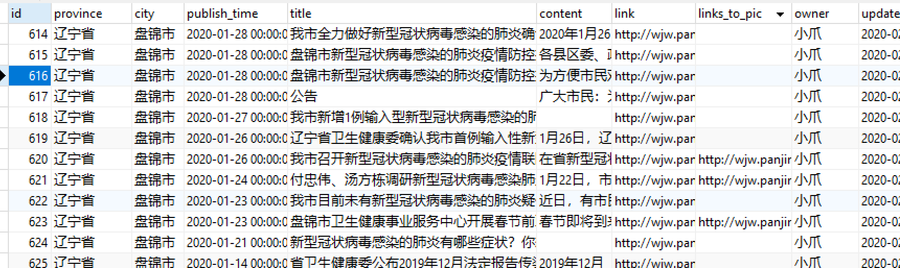

[wuhan2020项目](https://github.com/wuhan2020)需要爬取各地卫健委的最新通知，经过清洗后获得疫情传播及防治相关的信息。然而全国大概有293个地级市，如果一个网站一套解析规则的话，工作量可想而知，于是想写一套尽量通用的代码来爬取这种通知类网站。

幸运的是，这一类网站特征比较明显，且非常通用，也可以用在诸如学校的通知等领域，所以开放出来让大家可以少花点时间。

主要思路就是通过筛选含有时间的`li`和`tr`标签，但有可能多爬取一部分（比如页面上有多个栏目，都含有时间）

**本套代码已成功爬取东三省除大连市外所有地级市卫计委数据**

**更新：**

目前已成功爬取130/135个卫计委网站，爬取失败的除大连外，均为存在WAF防护，除了使用WebDriver之外好像没有好的解决方案。

### TODO
1. 大连市通知列表不含有时间，暂时没想到好方法来提取
1. 比起粗糙的直接查找`li`，先查找`ul`，再根据其下面`li`的个数来判断其是否为目标列表
